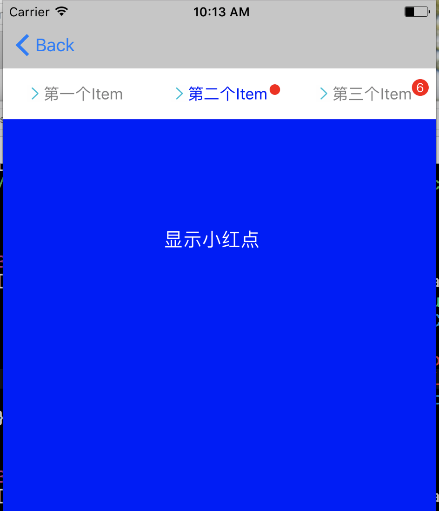
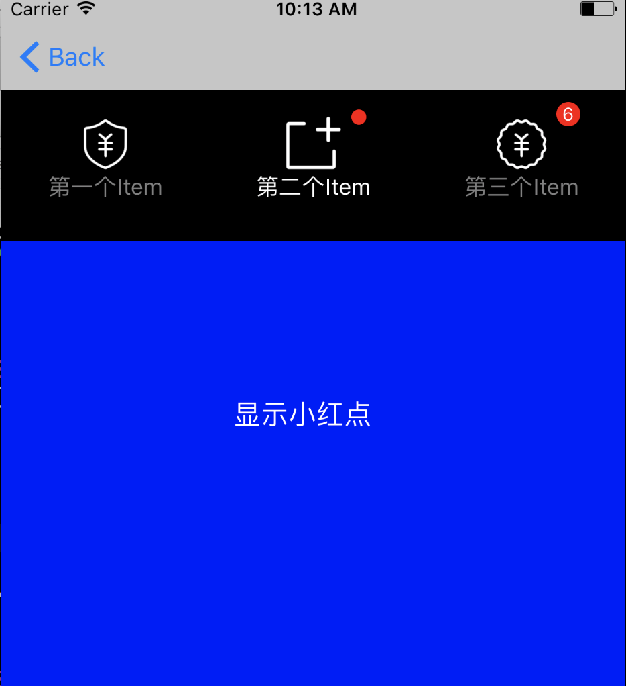
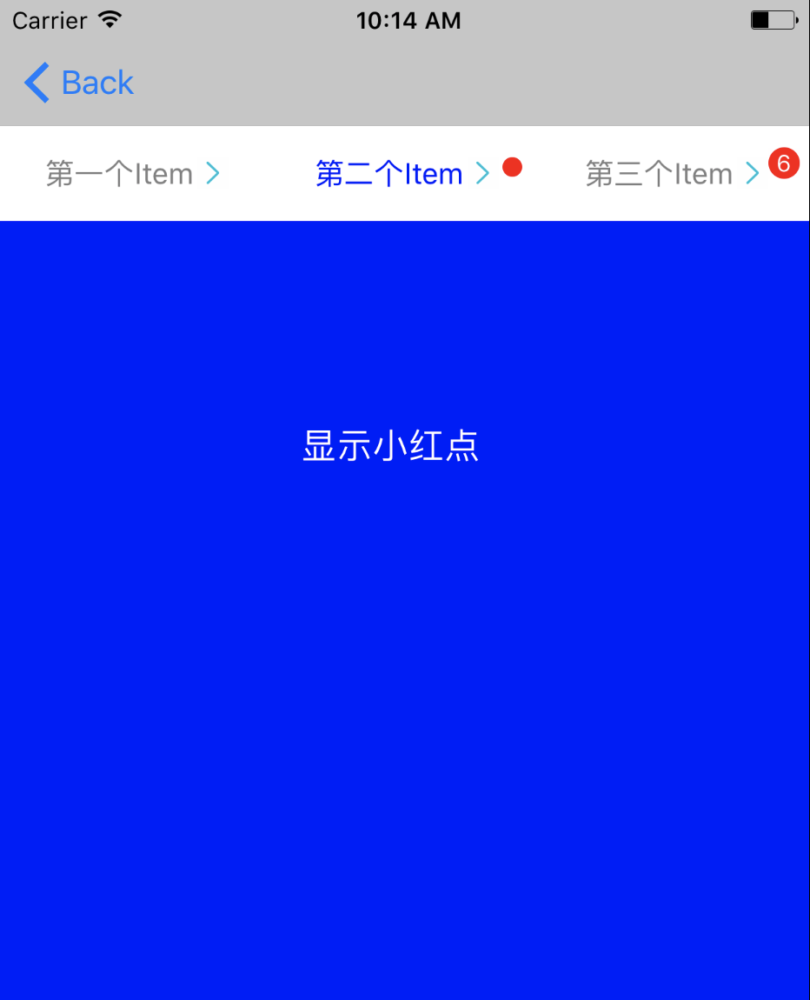

# XZTabBarCtrl

这是带有顶部toolBar的控制器，支持圆形小红点、数字小红点、多种图文样式，与APPLE官方控件-UITabBarViewController一样的代理设计模式，简单易用。

作者：kizy

QQ：358033194

<a href="#case">案例</a> 
<a href = "#use">使用教程</a>
<h1 name = "case">案例</h1>

<h1 name = "use">How to use XZTabBarCtrl(如何使用XZTabBarCtrl)</h1>
<ul>
<li>Manual import:(手动引用)
<ul>
<li>
Drag All files in the <code>XZTabBarCtrl</code>folder to project 
(将<code>XZTabBarCtrl</code>文件夹及子文件拉到你的项目中)
</li>
<li>
Import the main file：<code>#import "XZTabBar.h"</code> 
(引用头文件<code>XZTabBar.h</code>)</li>
</ul>
</li>
</ul>
<h3>initialize：the same to UITabBarViewController(初始化:和UITabBarViewController)</h3>

<pre>
UIViewController *ctrl1 = [[UIViewController alloc] init];
UIViewController *ctrl2 = [[OneViewCtrl alloc] init];
UIViewController *ctrl3 = [[RedViewCtrl alloc] init];

XZTabBarCtrl *tabBarCtrl = [[XZTabBarCtrl alloc] init];

//将子控制器加入childVCs，用法类似UITabBarViewController的viewControllers
tabBarCtrl.childVCs = @[ctrl1, ctrl2, ctrl3];

为顶部ToolBar添加需要显示的标题
tabBarCtrl.toolBarTitles = @[@"第一个Item", @"第二个Item", @"第三个Item"];
</pre>
<h3>properties of XZTabBarCtrl:(属性)</h3>
<pre>@interface XZTabBarCtrl : UIViewController

//  代理
@property (nonatomic, weak) id<XZTabBarCtrlDelegate> delegate;

//  @decription toolBarItem's title: 存放自定义tooleBar的标题数组
//  @warning    该属性可为空，为空表示不创建tooleBar
@property (nonatomic, copy) NSArray *toolBarTitles;

//  @decription toolBarItem's image: 存放自定义tooleBar的图片数组
//  @warning    该属性可为空，如需赋值，count大小需与toolBarTitles一致
@property (nonatomic, copy) NSArray *toolBarImages;

//  @decription toolBar's height: 设置toolBar的高度，默认高度为49.0f
@property (nonatomic, assign) CGFloat toolBarHeight;

//  @decription 自定义的toolBar
//  @warning    toolBar整个机制类似UITabBarController的tabBar：一个XZTabBarCtrl只有一个customeToolBar；每个子控制器拥有独立的ToolBarItem，可支持小红点、标题更改 etc, 子控制器获取该tooleBarItem需要引用文件"XZTabBar.h"
@property (nonatomic, weak) UIView *customToolBar;

//  @decription toolBarItem显示样式
//  ToolBarItemType_default,    //默认显示系统正常排列按钮
//  ToolBarItemType_normalImgText,    //左右图文按钮
//  ToolBarItemType_unnormalImgText,    //上下图文按钮
@property (nonatomic, assign) ToolBarItemType itemType;

//  @decription  控制toolBar的背景颜色，default is blackColor
@property (nonatomic, strong) UIColor *xzToolBarColor;

//  @decription  控制toolItem的文字正常显示颜色，default is grayColor
@property (nonatomic, strong) UIColor *xzTitleColor;

//  @decription  控制被选中toolItem的文字显示颜色，default is whiteColor
@property (nonatomic, strong) UIColor *xzTitleSelectedColor;

//  @decription 存放子控制器的数组
//  @warning    该属性不能为空，必须赋值
@property (nonatomic, copy) NSMutableArray<__kindof UIViewController *> *childVCs;

//
//  @decription  当前显示的控制器的Index
//  @warning    该属性用法类似UITabBarController的selectedIndex属性
@property (nonatomic, assign) NSInteger selectedIndex;
</pre>

